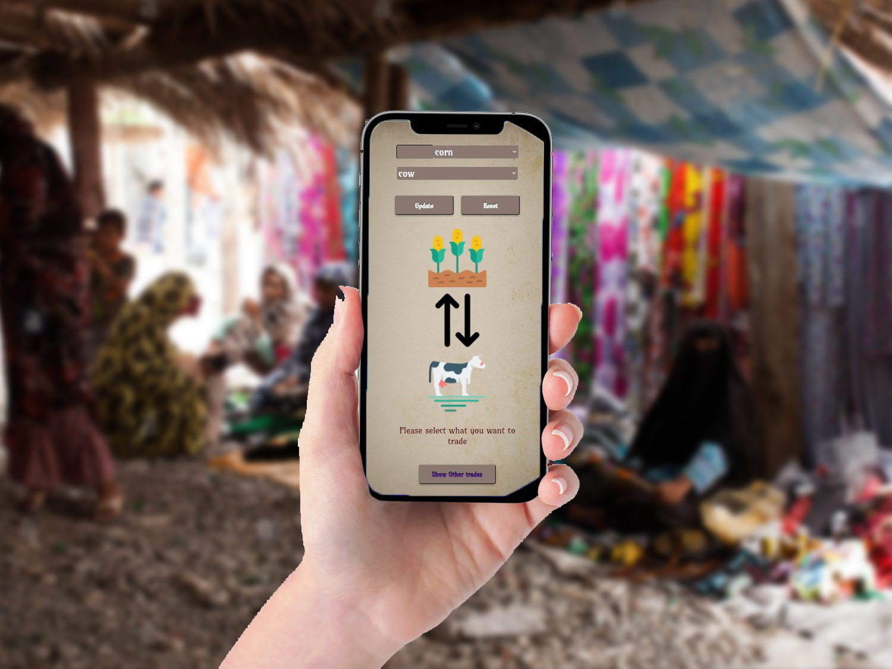
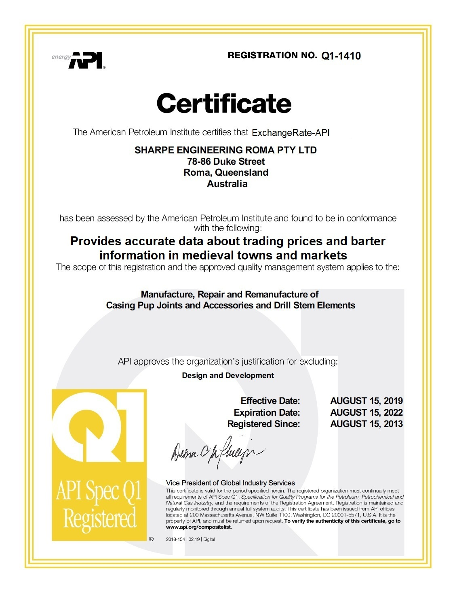

# Hackathon - Back to the future

## FAIRTRADE

## Table of contents
* [Challenge](#challenge)
* [Journey](#journey)
* [Idea](#idea)
* [General info](#general-info)
* [API certificate](#api-certificate)
* [Setup](#setup)
* [Features](#features)
* [Contact](#contact)

### Challenge
> Wilders have the power to travel back in time and bring all their technology with them. They can explore the period of their choice in order to create an application that can be perfectly adapted to the needs of the times.

### Journey
We must have got kidnapped.
I can’t remember anything
except from waking up somewhere,
we had never been before.
It was a very crowded place
it was noisy and smelly,
it was people, animals and stuff everywhere.

**** 

We obviously travelled back in time -
to the Middle Ages.
We found ourselves in the middle of a market.
How is that possible?

****

We had no idea how we got here,
and still less, how we should travel back.
So we decided to find something to eat and
a place to stay until we found out 
how to travel back to the future.

****

We are walking over the market.
It is wild trading all over the place.
Next to us, an old women is buying a chicken.
It’s head ist just cut off with an axe
blood all over the place.
That’s not what we prefer to have for lunch today.

****

We go on until we find this guy selling bread.
It looks like the best option for us.
But how should we pay?

Do you think he’s gonna accept ApplePay?
We brought nothing with us - 
except from our smartphones.

****

How do those people buy stuff without a smartphone?

We find a man, Robin, who is willing to explain the trading principles to us.

There is nothing like a currency.
Everything is about barter, that means:
bring sth to the market and change it for whatever you need.
Maybe bring more of whatever you have
since you never know what you will get in exchange today.

#### And for sure, watch out to not to get pulled over the barrel!

That is daily business

And it’s many people who already lost a lot by getting tricked.

…..

We are leaving the market to think about what Robin told us

#### I think we can solve this issue and bring fairness into this world!

### Idea

There should be exchange rates,

being accessible for everyone.

Everyone should be able to know 

at every time,

what he could get in exchange, 

for what he wants to trade.

## Fairtrade App

## General info
We created an App to make trade in the Middle Ages fair.
The App is accessible for everyone.
It is as simple as possible to solve the problem of
no more getting pulled over the barrel from now on.

You can simply choose the product along with the amount,
you want to exchange, and the product you want to get
from a dropdown that shows you 
all the possible items for trading. 

Decide how many you have got for excahnge and
see how many you will get- today.

And always keep in mind that prices are fluctuating.
So be smart and watch the market!

## API certificate

## Setup
Get the App here:
https://condescending-poitras-f71883.netlify.app/

## Features
* get best deals for your items, space-monkeys and sexy-farmers
* integrated price fluctuation
* certified API about trading prices and data in medieval towns and markets

To-do list:
* Arrows will turn into different colors, depending on how good your trade is.
* Integrate a graph showing the fluctuation

## Contact
Created by Victoria, Carlos, Yury and Nadine

